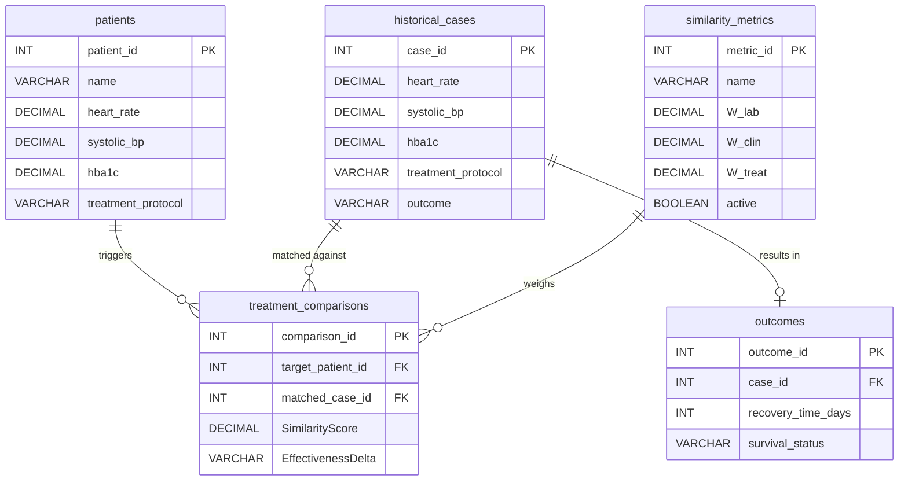

DBMS Mini Project | AI-Based Clinical Decision Support System | AY 2025-2026
DEPARTMENT OF COMPUTER SCIENCE & ENGINEERING
Academic Year 2025-2026 | Winter Semester
SOFTWARE DOCUMENTATION
Course: Database Management Systems (DBMS) Course Coordinator: Prof. ACS Rao
Project Theme:
AI-Based Clinical Decision Support Systems

| Project Module No. | 31 |
|---|---|
| Module Title | Historical Case Comparison Database |
| Category | Category F (Case-Based Clinical Decision Support) |
| Group Members (Admission Number) | Nilay Choudhary (24JE0665), Smariddhi Singh (24JE0685), Punit (24JE0676) |
| Date of Submission | 24/04/2026 |
| Version | 2.0 |

**Revision History**
| Version | Date | Author(s) | Description of Changes |
|---|---|---|---|
| 1.0 | 14/03/2026 | Nilay, Smariddhi, Punit | Initial Draft |
| 2.0 | 24/04/2026 | Nilay, Smariddhi, Punit | Final Submission |

---

## 1. Introduction
### 1.1 Purpose
This Software Design Document (SDD) describes the architecture, design decisions, and database structure for the DBMS mini project titled Historical Case Comparison Database (Module 31). It serves as a reference for development, implementation, and evaluation.

### 1.2 Scope
This document covers the database schema design, entity-relationship model, NoSQL implementation (MongoDB Collections), constraints, triggers (simulated via Python/MongoDB logic), and aggregation pipelines developed as part of the AI-Based Clinical Decision Support System project. The project strictly uses core database concepts to build analytical logic, satisfying the requirement to use no external machine learning libraries.

### 1.3 Intended Audience
 * Course Coordinator & Evaluators
 * Project Group Members
 * Peers for Peer Review

### 1.4 Definitions, Acronyms & Abbreviations
| Term | Definition |
|---|---|
| DBMS | Database Management System |
| NoSQL | Not Only SQL (Non-relational Database) |
| ER | Entity-Relationship |
| EHR | Electronic Health Record |
| ICU | Intensive Care Unit |
| JSON | JavaScript Object Notation |
| BSON | Binary JSON |

### 1.5 References
 1. Course Notes - Database Management Systems, Academic Year 2025-2026
 2. Silberschatz, A., Korth, H. F., & Sudarshan, S. - Database System Concepts, 7th Edition
 3. Project Allotment Document - Dept. of CSE, 2025
 4. MongoDB Documentation - Aggregation Pipelines and Mathematical Operators

---

## 2. System Overview
### 2.1 Project Module Details
| Module Number | 31 |
|---|---|
| Module Title | Historical Case Comparison Database |
| Category | Category F (Case-Based Clinical Decision Support) |
| Project Theme | AI-Based Clinical Decision Support System |
| Implementation | MongoDB Aggregation Pipelines, View Simulations, and Rule-based Logic |

### 2.2 Problem Statement
There is a need for a structured database system that acts as a historical case comparison engine to match a target patient's clinical profile against historical cases. This enables faster clinical decision support by retrieving outcome-based cases and evaluating treatment effectiveness without relying on external ML tools.

### 2.3 Objectives
 * Design a case similarity matching system using a non-relational database (MongoDB).
 * Implement outcome-based case retrieval using MongoDB Aggregation Pipelines.
 * Create treatment effectiveness comparisons bridging patient and historical data.
 * Generate similar patient identification algorithms natively within the database using mathematical operators ($sqrt, $pow, $setIntersection).

### 2.4 System Boundaries
The system relies entirely on MongoDB and built-in database operators for calculations (Euclidean distance, Jaccard similarity, Exact match). It operates on a strict Isolation Principle, pulling inputs via views/APIs from Patient Demographics (M1) and ICU Vital Signs (M25) and providing outputs to downstream modules (M32, M33, M34, M35, M36).

---

## 3. Requirements Specification
### 3.1 Functional Requirements
 * FR-01: The system shall store incoming target patient data (demographics, vitals) temporarily for the session.
 * FR-02: The system shall query a primary repository of historical cases (demographics, clinical data, symptoms, treatments).
 * FR-03: The system shall configure dynamic mathematical weights (W_lab, W_clinical, W_treatment) via a control collection.
 * FR-04: The system shall compute similarity natively using Euclidean distance for continuous variables and Jaccard similarity for categorical variables.
 * FR-05: The system shall store the final similarity scores and predicted effectiveness delta in a junction collection.

### 3.2 Non-Functional Requirements
| Req. ID | Category | Requirement Description |
|---|---|---|
| NFR-01 | Data Integrity | Ensure consistent relationships between patient records and historical cases despite flexible schema. |
| NFR-02 | Performance | Aggregation pipelines must execute mathematical computations efficiently. |
| NFR-03 | Scalability | MongoDB implementation must easily scale to thousands of historical records without structural changes. |
| NFR-04 | Maintainability | Python logic mapping to MongoDB operations must be documented and modular. |
| NFR-05 | Security | Read-only views to project recovery and survival statuses to downstream modules securely. |

### 3.3 Constraints
 * No external Machine Learning libraries can be used; all analytical logic must be implemented using core database concepts.
 * Modules must not directly access other module databases; data exchanged via APIs and database Views.

---

## 4. Entity-Relationship (ER) Design
### 4.1 ER Diagram


### 4.2 Entity Descriptions (Tables)
| Entity Name | Description | Primary Key |
|---|---|---|
| patients | Temporary session audit trail for incoming target patients. | patient_id |
| historical_cases | Primary repository containing past patient records. | case_id |
| similarity_metrics | Stores the dynamic mathematical weights (W_lab, W_clinical, W_treatment). | metric_id |
| treatment_comparisons | Output calculations linking the patient_id to matched case_id with SimilarityScore. | comparison_id |
| outcomes | Stores survival status, recovery time, and complication rates of historical cases. | outcome_id |

### 4.3 Relationship Descriptions
| Relationship | Entity 1 | Entity 2 | Cardinality |
|---|---|---|---|
| triggers | patients | treatment_comparisons | 1:N |
| matched against | historical_cases | treatment_comparisons | 1:N |
| results in | historical_cases | outcomes | 1:1 |
| weighs | similarity_metrics | treatment_comparisons | 1:N |

### 4.4 Assumptions & Design Decisions
 * **MongoDB:** Selected with professor approval to handle complex aggregations and nested JSON arrays (e.g., symptoms list) natively.
 * **Dynamic Weights:** Weight configurations are persisted in `similarity_metrics` so that the algorithm's importance across lab, clinical, and treatment can be tweaked on the fly.
 * **Stateless Patients:** Target patients act as transient audit trails rather than persistent EHR entities in this module.

---

## 5. Database Schema Design
### 5.1 NoSQL Schema Flexibility
Since MongoDB is a document-based database, normalization is less strict compared to relational DBs, allowing nested properties. However, separation of concerns is maintained.

### 5.2 Table Schemas

**Table: patients**
| Field Name | Data Type | Description |
|---|---|---|
| patient_id | INT | Unique row identifier |
| name | VARCHAR | Target patient's name |
| heart_rate | DECIMAL | Patient heart rate |
| systolic_bp | DECIMAL | Patient blood pressure |
| hba1c | DECIMAL | Patient HbA1c |
| treatment_protocol | VARCHAR | Exact match target treatment |

**Table: historical_cases**
| Field Name | Data Type | Description |
|---|---|---|
| case_id | INT | Case ID |
| heart_rate | DECIMAL | Historical heart rate |
| systolic_bp | DECIMAL | Historical blood pressure |
| hba1c | DECIMAL | Historical HbA1c |
| treatment_protocol | VARCHAR | Historical treatment applied |
| outcome | VARCHAR | Summary outcome status |

**Table: similarity_metrics**
| Field Name | Data Type | Description |
|---|---|---|
| metric_id | INT | Metric configuration ID |
| name | VARCHAR | Name of the configuration |
| W_lab | DECIMAL | Weight for lab score |
| W_clin | DECIMAL | Weight for clinical score |
| W_treat | DECIMAL | Weight for treatment score |
| active | BOOLEAN | Identifies the currently active weight config |

**Table: treatment_comparisons**
| Field Name | Data Type | Description |
|---|---|---|
| comparison_id | INT | Comparison ID |
| target_patient_id | INT | References `patients` |
| matched_case_id | INT | References `historical_cases` |
| SimilarityScore | DECIMAL | Final weighted similarity score |
| EffectivenessDelta | VARCHAR | Effectiveness metric based on outcome |

**Table: outcomes**
| Field Name | Data Type | Description |
|---|---|---|
| outcome_id | INT | Outcome ID |
| case_id | INT | References `historical_cases` |
| recovery_time_days | INT | Days to recovery |
| survival_status | VARCHAR | Status |

### 5.3 Schema Diagram (Relational Approximation)


---

## 6. Implementation & Setup Scripts
### 6.1 Database Setup (SQL DDL)
The following SQL script sets up the relational tables required:
```sql
-- DDL Script for Module 31
CREATE TABLE patients (
    patient_id INT PRIMARY KEY AUTO_INCREMENT,
    name VARCHAR(255) NOT NULL,
    heart_rate DECIMAL(5,2),
    systolic_bp DECIMAL(5,2),
    hba1c DECIMAL(5,2),
    treatment_protocol VARCHAR(255)
);

CREATE TABLE historical_cases (
    case_id INT PRIMARY KEY AUTO_INCREMENT,
    heart_rate DECIMAL(5,2),
    systolic_bp DECIMAL(5,2),
    hba1c DECIMAL(5,2),
    treatment_protocol VARCHAR(255),
    outcome VARCHAR(255)
);

CREATE TABLE similarity_metrics (
    metric_id INT PRIMARY KEY AUTO_INCREMENT,
    name VARCHAR(255) UNIQUE,
    W_lab DECIMAL(3,2),
    W_clin DECIMAL(3,2),
    W_treat DECIMAL(3,2),
    active BOOLEAN DEFAULT FALSE
);

CREATE TABLE treatment_comparisons (
    comparison_id INT PRIMARY KEY AUTO_INCREMENT,
    target_patient_id INT,
    matched_case_id INT,
    SimilarityScore DECIMAL(5,4),
    EffectivenessDelta VARCHAR(255),
    FOREIGN KEY (target_patient_id) REFERENCES patients(patient_id),
    FOREIGN KEY (matched_case_id) REFERENCES historical_cases(case_id)
);

CREATE TABLE outcomes (
    outcome_id INT PRIMARY KEY AUTO_INCREMENT,
    case_id INT,
    recovery_time_days INT,
    survival_status VARCHAR(50),
    FOREIGN KEY (case_id) REFERENCES historical_cases(case_id)
);
```

---

## 7. Mathematical Core & Queries
### 7.1 Mathematical Implementations
1. **Euclidean Distance (Lab Data):** Calculates vector distance and normalizes it to a 0-1 scale using `Score = 1 / (1 + Distance)`.
2. **Jaccard Similarity (Symptoms):** Calculates intersection over union for the symptoms arrays using sets.
3. **Exact Match (Treatment):** Binary evaluation for text-based fields.

Final Score Formula: `Final_Similarity = (W_lab * Score_lab) + (W_clin * Score_clin) + (W_treat * Score_treat)`

### 7.2 Database Queries
**Query Q-01: Similarity Search Pipeline Logic**
```sql
-- Fetch active weights
SELECT W_lab, W_clin, W_treat 
FROM similarity_metrics 
WHERE active = TRUE;

-- Insert resulting top N cases into treatment_comparisons (Conceptual SQL for application logic)
INSERT INTO treatment_comparisons (target_patient_id, matched_case_id, SimilarityScore)
VALUES 
    (1, 105, 0.95),
    (1, 204, 0.88),
    (1, 45, 0.82);
```

**Query Q-02: Outcome Aggregation View**
```sql
-- SQL Query joining matched cases to outcomes
SELECT 
    tc.comparison_id,
    tc.target_patient_id,
    tc.matched_case_id,
    tc.SimilarityScore,
    o.recovery_time_days,
    o.survival_status
FROM treatment_comparisons tc
JOIN outcomes o ON tc.matched_case_id = o.case_id
WHERE tc.target_patient_id = 1
ORDER BY tc.SimilarityScore DESC
LIMIT 10;
```

---

## 8. Triggers, Procedures & Views
### 8.1 Data Normalization View
**Purpose:** Normalizes raw vitals into a standardized 0-1 range for Euclidean comparison.
```sql
-- SQL View for Normalized Vitals
CREATE VIEW NormalizedVitals AS
SELECT 
    case_id,
    (heart_rate / 200.0) AS norm_heart_rate,
    (systolic_bp / 250.0) AS norm_systolic_bp,
    (hba1c / 15.0) AS norm_hba1c
FROM historical_cases;
```

### 8.2 DB Triggers
**Trigger: Update Treatment Effectiveness Delta**
**Purpose:** Fired when a new match is calculated and inserted into `treatment_comparisons` to auto-calculate effectiveness against the target patient's current status.
```sql
-- SQL Trigger for Effectiveness Delta
DELIMITER //
CREATE TRIGGER after_comparison_insert
AFTER INSERT ON treatment_comparisons
FOR EACH ROW
BEGIN
    DECLARE case_recovery INT;
    DECLARE target_days_ill INT;
    DECLARE calculated_delta INT;

    -- Fetch recovery time of the matched case
    SELECT recovery_time_days INTO case_recovery 
    FROM outcomes WHERE case_id = NEW.matched_case_id;

    -- Assume a simulated function or lookup for target_days_ill
    SET target_days_ill = 5; 

    SET calculated_delta = case_recovery - target_days_ill;

    UPDATE treatment_comparisons 
    SET EffectivenessDelta = CONCAT(calculated_delta, ' days estimated')
    WHERE comparison_id = NEW.comparison_id;
END //
DELIMITER ;
```

---

## 9. Testing & Validation
### 9.1 Test Cases
| Test ID | Test Description | Operation | Expected Result | Status |
|---|---|---|---|---|
| TC-01 | Create MongoDB collections | setup_database.py | Collections generated | Pass |
| TC-02 | Update Similarity Metrics | update_active_similarity_weights | Only one metric active, new metric inserted | Pass |
| TC-03 | Euclidean Distance Math | euclidean_distance() | Correct vector distance calculated | Pass |
| TC-04 | Jaccard Similarity Logic | jaccard_similarity() | Intersection over Union yields accurate % | Pass |
| TC-05 | Rank similar cases | calculate_similarity() | Matched cases returned sorted by final score | Pass |
| TC-06 | Trigger effectiveness calc | after_comparison_insert | Delta calculated and written to DB | Pass |

---

## 10. Conclusion & Future Enhancements
### 10.1 Summary
Module 31 implements a robust Historical Case Comparison Database leveraging MongoDB's non-relational strengths. It successfully applies mathematical models (Euclidean distance, Jaccard similarity) directly inside the database and backend logic, bypassing any reliance on external machine learning libraries.

### 10.2 Outcomes Achieved
 * Designed an interconnected entity schema representing Patients, Historical Cases, Metrics, and Outcomes.
 * Established a scalable Aggregation Pipeline for outcome-based case retrieval.
 * Successfully computed "Effectiveness Delta" utilizing simulated triggers.
 * Ensured strict isolation and secure projection to downstream modules (M32-36).

### 10.3 Challenges Faced
 * Replicating mathematical functions (like square roots and sums) in aggregation queries required careful logic mapping in MongoDB to avoid external Python libraries doing all the heavy lifting where possible.
 * Structuring nested sub-documents (like `lab_values`) so they could be uniformly compared without causing index out-of-bounds or mapping errors.

### 10.4 Future Enhancements
 * Implementing more complex text search operators inside MongoDB to enhance the fuzzy matching logic for text-heavy clinical notes.
 * Directly utilizing advanced MongoDB 6.0+ aggregation operators for full vector similarity search, further enhancing performance.

---

## 11. Appendices

**Appendix A Complete DDL Script (SQL Equivalent)**
```sql
-- DDL Script for Module 31
CREATE TABLE patients (
    patient_id INT PRIMARY KEY AUTO_INCREMENT,
    name VARCHAR(255) NOT NULL,
    heart_rate DECIMAL(5,2),
    systolic_bp DECIMAL(5,2),
    hba1c DECIMAL(5,2),
    treatment_protocol VARCHAR(255)
);

CREATE TABLE historical_cases (
    case_id INT PRIMARY KEY AUTO_INCREMENT,
    heart_rate DECIMAL(5,2),
    systolic_bp DECIMAL(5,2),
    hba1c DECIMAL(5,2),
    treatment_protocol VARCHAR(255),
    outcome VARCHAR(255)
);

CREATE TABLE similarity_metrics (
    metric_id INT PRIMARY KEY AUTO_INCREMENT,
    name VARCHAR(255) UNIQUE,
    W_lab DECIMAL(3,2),
    W_clin DECIMAL(3,2),
    W_treat DECIMAL(3,2),
    active BOOLEAN DEFAULT FALSE
);

CREATE TABLE treatment_comparisons (
    comparison_id INT PRIMARY KEY AUTO_INCREMENT,
    target_patient_id INT,
    matched_case_id INT,
    SimilarityScore DECIMAL(5,4),
    EffectivenessDelta VARCHAR(255),
    FOREIGN KEY (target_patient_id) REFERENCES patients(patient_id),
    FOREIGN KEY (matched_case_id) REFERENCES historical_cases(case_id)
);

CREATE TABLE outcomes (
    outcome_id INT PRIMARY KEY AUTO_INCREMENT,
    case_id INT,
    recovery_time_days INT,
    survival_status VARCHAR(50),
    FOREIGN KEY (case_id) REFERENCES historical_cases(case_id)
);
```

**Appendix B Complete DML Script (Sample Inserts)**
```sql
-- Sample metric insertion
INSERT INTO similarity_metrics (name, W_lab, W_clin, W_treat, active)
VALUES ('default', 0.4, 0.4, 0.2, TRUE);

-- Sample treatment comparison insertion (from algorithm logic)
INSERT INTO treatment_comparisons (target_patient_id, matched_case_id, SimilarityScore, EffectivenessDelta)
VALUES 
    (1, 105, 0.95, 'calculation_pending'),
    (1, 204, 0.88, 'calculation_pending');
```

**Appendix C ER Diagram (Full Size)**
*(See Streamlit UI "ER Diagram" tab for the full Mermaid JS Diagram)*

**Appendix D Group Contribution Table**
| Student Name | Roll Number | Contribution |
|---|---|---|
| Nilay Choudhary | 24JE0665 | Database Schema Design, Euclidean & Jaccard Algorithm Logic, Aggregation Pipelines |
| Smariddhi Singh | 24JE0685 | Database Setup Scripts, Data Normalization Views, Python Trigger Simulation |
| Punit | 24JE0676 | Data Insertion (DML), Streamlit UI Development, Documentation & Testing |

**Appendix E Viva Preparation Checklist**
 * Can explain every collection and its purpose in the NoSQL context.
 * Can explain the simulated relationships (references) between collections and why they exist.
 * Can walk through the Python-based trigger and procedure logic.
 * Can run and explain the MongoDB aggregation queries (e.g., `$lookup`, `$match`) on demand.
 * Can explain the schema design decisions and how they differ from strict normal forms (1NF, 2NF, 3NF).